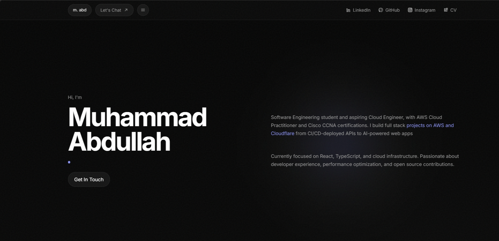
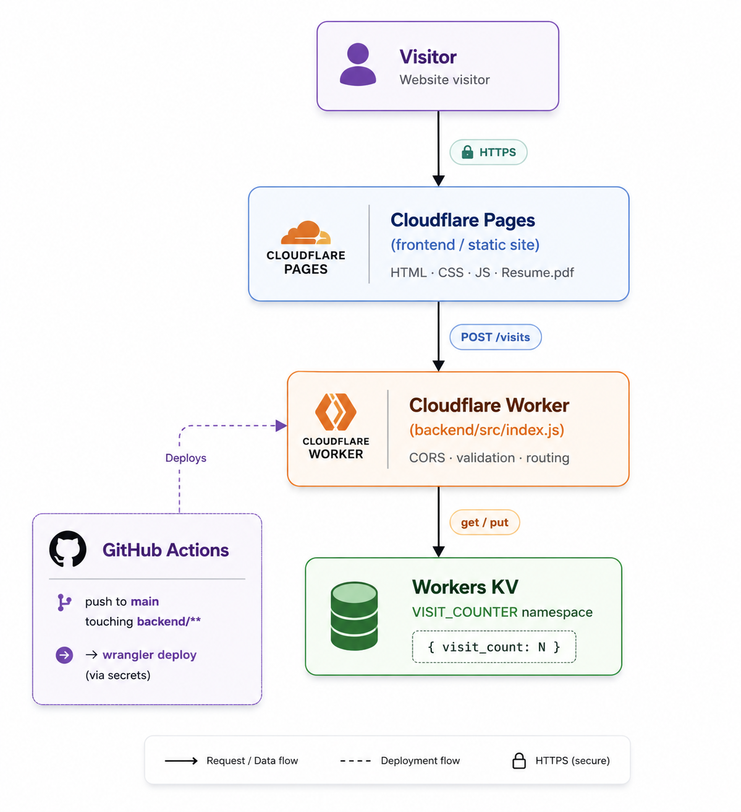
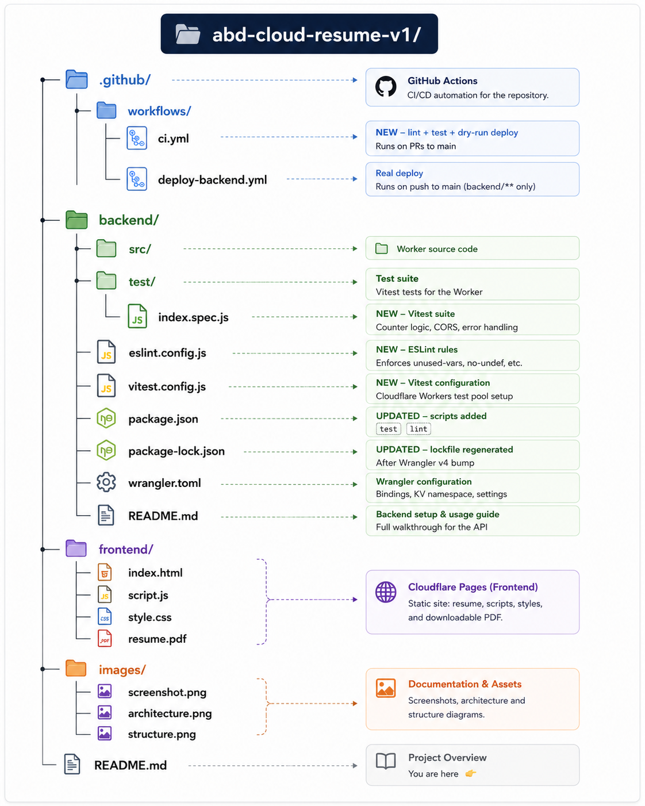

<div align="center">

# ☁️ Cloud Resume Challenge

### A serverless, full-stack resume site built on Cloudflare's edge platform

**[🌐 Live Site](https://abd-cloud-resume-v1.pages.dev)** · **[📄 Backend Docs](./backend/README.md)** · **[ Report an Issue](https://github.com/nicocodes9/abd-cloud-resume-v1/issues)**


</div>

---

## 📖 About This Project

This is my take on the [**Cloud Resume Challenge**](https://cloudresumechallenge.dev/) — the well-known hands-on project designed to prove cloud engineering skills through a real, deployed, production-grade application rather than a certificate alone.

Instead of building it on AWS (the "default" path most candidates take), I deliberately built it on **Cloudflare's free-tier stack** — Pages, Workers, and KV — while consciously mapping every primitive back to its AWS equivalent. The goal was to demonstrate the _underlying cloud engineering concepts_ (static hosting at the edge, serverless compute, NoSQL persistence, infrastructure-as-code, CI/CD pipelines, and automated quality gates) rather than tie the project to one vendor's console.

| Cloudflare Primitive           | AWS Equivalent             | Role in this project                                      |
| ------------------------------ | -------------------------- | --------------------------------------------------------- |
| **Pages**                      | S3 + CloudFront            | Hosts and serves the static resume site from the edge     |
| **Workers**                    | Lambda + API Gateway       | Serverless function powering the visitor-counter REST API |
| **Workers KV**                 | DynamoDB                   | Key-value store that persists the visit count             |
| **Wrangler (`wrangler.toml`)** | CloudFormation / Terraform | Infrastructure-as-code for the Worker + KV binding        |
| **GitHub Actions**             | CodePipeline / CodeBuild   | CI/CD pipeline that lints, tests, and auto-deploys        |

---

## Screenshot



## Features

- 🖥️ **Static resume site** — a fast, responsive portfolio page with a downloadable PDF resume
- 🔢 **Live visitor counter** — a serverless API increments and returns a persistent visit count on every page load, animated into view on the frontend
- ⚙️ **Serverless backend** — a Cloudflare Worker with proper CORS handling, input validation, and graceful failure (the UI shows `—` instead of breaking if the API is ever down)
- 🧪 **Automated testing & linting** — a full Vitest suite (using Cloudflare's Workers test pool) covers the counter logic, CORS, and error handling, backed by an ESLint quality gate — both run automatically on every pull request
- 🔁 **Automated CI/CD** — GitHub Actions redeploys the Worker automatically whenever `backend/**` changes on `main`, using scoped secrets for authentication, and every PR gets a lint + test + dry-run check before it can be merged
- 🔒 **Locked-down CORS** — the API only accepts requests from the deployed Pages origin, not `*`
- 🧹 **Clean repo hygiene** — properly scoped `.gitignore` files at both the root and `backend/` level, with no secrets or local caches ever committed

---

## Architecture

<p align="center">
  
</p>

**Request flow:** the browser loads the static site from Pages → `script.js` fires a `POST` to the Worker's `/visits` endpoint → the Worker reads the current count from KV, increments it, writes it back, and returns `{ "count": N }` → the frontend animates the new number into the footer.

**Delivery pipeline** (new): every change now passes through a quality gate before it can reach production.

## 📁 Repository Structure

<p align="center">
  
</p>

---

## 🛠️ Tech Stack

**Frontend**

- Vanilla HTML5 / CSS3 / JavaScript (no framework — kept intentionally lightweight)
- Deployed to **Cloudflare Pages**, served from the edge with no separate CDN needed
  **Backend**

- **Cloudflare Workers** — serverless JavaScript runtime at the edge
- **Workers KV** — eventually-consistent key-value store for the visit counter
  **Testing & Code Quality**

- **Vitest** + **`@cloudflare/vitest-pool-workers`** — runs the Worker's test suite against a real `workerd` runtime, not a mock
- **ESLint** — catches unused/undefined variables before merge
  **DevOps / Tooling**

- **Wrangler CLI v4** — Cloudflare's infrastructure-as-code and deployment tool
- **GitHub Actions** — two workflows: `ci.yml` (lint/test/dry-run on PRs) and `deploy-backend.yml` (real deploy on push to `main`)
- **GitHub Secrets** — stores `CLOUDFLARE_API_TOKEN` and `CLOUDFLARE_ACCOUNT_ID` for the deploy job

---

## 🔌 API Reference

The backend exposes a single endpoint from the Worker.

### `POST /visits`

Increments the visit counter by 1 and returns the new total.

**Request**

```bash
curl -X POST https://cloud-resume-counter.nicoband9.workers.dev/visits
```

**Response — `200 OK`**

```json
{ "count": 42 }
```

**Response — `500 Internal Server Error`** (KV unavailable)

```json
{ "error": "Counter unavailable" }
```

**Response — `405 Method Not Allowed`** (any method other than `POST`/`OPTIONS`)

```json
{ "error": "Method not allowed" }
```

`OPTIONS` requests are handled automatically for CORS preflight and return `204 No Content`.

CORS is locked down to a single allowed origin — the deployed Pages URL — so the API cannot be called from arbitrary third-party sites.

---

## Getting Started Locally

### Prerequisites

- [Node.js](https://nodejs.org/) 20+
- A free [Cloudflare account](https://dash.cloudflare.com/sign-up)
- The [Wrangler CLI](https://developers.cloudflare.com/workers/wrangler/): `npm install -g wrangler`

### 1. Clone the repo

```bash
git clone https://github.com/nicocodes9/abd-cloud-resume-v1.git
cd abd-cloud-resume-v1
```

### 2. Set up the backend

Full step-by-step instructions — creating the KV namespace, wiring up `wrangler.toml`, running the Worker locally, deploying, and locking down CORS — live in **[`backend/README.md`](https://github.com/nicocodes9/abd-cloud-resume-v1/blob/main/backend/README.md)**. In short:

```bash
cd backend
npm install
wrangler login
wrangler kv namespace create "VISIT_COUNTER"   # then paste the returned id into wrangler.toml
wrangler dev                                    # local dev server
```

### 3. Run tests and lint before deploying

```bash
npm test          # runs the Vitest suite against the real Workers runtime
npm run lint       # runs ESLint
```

Both of these run automatically on every pull request via `ci.yml` — running them locally first avoids a red CI check.

```bash
wrangler deploy    # ship it
```

### 4. Point the frontend at your Worker

In `frontend/script.js`, update:

```javascript
const COUNTER_API_URL =
  "https://your-worker-name.your-subdomain.workers.dev/visits";
```

### 5. Serve the frontend

Any static file server works for local preview:

```bash
cd frontend
npx serve .
```

For production, connect the repo to **Cloudflare Pages** with the build output directory set to `frontend`.

---

## ⚙️ CI/CD Pipeline

Two GitHub Actions workflows work together to gate and ship changes:

**`.github/workflows/ci.yml`** — runs on every pull request targeting `main`:

1. Checks out the repository
2. Sets up Node.js
3. Installs dependencies
4. Runs `npm run lint` (ESLint)
5. Runs `npm test` (Vitest, against the real Workers runtime via `@cloudflare/vitest-pool-workers`)
6. Runs a dry-run deploy to confirm the Worker would deploy cleanly, without actually shipping it
   This is a quality gate — nothing in `ci.yml` touches production.

**`.github/workflows/deploy-backend.yml`** — runs on every push to `main` that touches `backend/**`:

1. Checks out the repository
2. Sets up Node.js 20
3. Runs `wrangler deploy` via `cloudflare/wrangler-action`, authenticating with `CLOUDFLARE_API_TOKEN` and `CLOUDFLARE_ACCOUNT_ID` pulled from **GitHub Secrets**
   The frontend is deployed separately and automatically by **Cloudflare Pages'** own Git integration whenever `frontend/**` changes — no custom workflow needed for that side.

> **Note:** `deploy-backend.yml`'s path filter is scoped to `backend/**`, so a change to the workflow file itself (or to the frontend) won't trigger a redeploy of the Worker. `ci.yml` runs on all PRs to `main` regardless of which paths changed, so lint/test coverage isn't accidentally skipped.

---

## 🔐 Security Notes

- The Cloudflare **Account ID** in `wrangler.toml` is not a secret — Cloudflare explicitly designs it to be safe for public repos. Only the **API Token** is sensitive, and it lives exclusively in GitHub Secrets, never in the codebase.
- `.gitignore` is scoped at **both** the repo root and inside `backend/`, since a nested `.gitignore` alone won't catch root-level artifacts like `.wrangler/cache/`.
- CORS on the Worker is restricted to the live Pages origin, not `*`, so the counter API can't be invoked cross-origin from unrelated sites.
- No `.env` / `.dev.vars` files are ever committed — both are explicitly ignored.
- `ci.yml`'s dry-run deploy step uses the same secrets as the real deploy but never actually publishes — worth double-checking your workflow doesn't leak secret values into PR logs from forked branches.

---

## 🎓 What This Project Demonstrates

Built as part of a cloud-engineering job search, this project is meant to show — not just tell — familiarity with:

- Static site hosting at the edge (CDN-equivalent architecture)
- Serverless compute and event-driven APIs
- NoSQL key-value persistence
- Infrastructure-as-code
- CI/CD pipeline design with scoped triggers, PR-based quality gates, and secret management
- Automated testing of serverless functions against a real runtime, not a mock
- Secure-by-default practices (CORS scoping, secret hygiene, `.gitignore` discipline)

---

## 📄 License

This project is licensed under the MIT License. See the [LICENSE](LICENSE) file for details. Its open for reference and learning purposes. Feel free to fork it and adapt it for your own Cloud Resume Challenge attempt.

---

## 👤 Author

<div align="center">
<h3>Muhammad Abdullah</h3>
<a href= "https://github.com/nicocodes9">GitHub@nicocodes9</a>
</div>
<div align="center">

_Built with ☁️ on Cloudflare's free tier._

</div>
